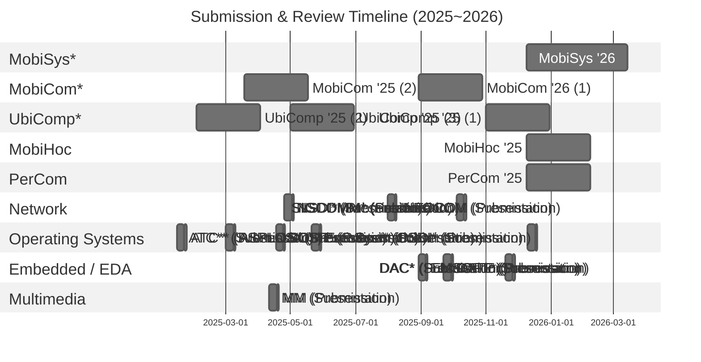

# Awesome-CS-Conferences
Conferences about mobile systems, computer networks, operating systems

```mermaid
%%{init: {'theme': 'neutral',
'themeVariables': {
      'fontSize': '18px'},
"gantt": {
      "fontSize": 16,
      "sectionFontSize": 18,
      "leftPadding": 200,
      "displayMode": "compact",
      "barHeight": 30
  }}}%%
gantt
    dateFormat  YYYY-MM-DD
    tickInterval 2month
    title Submission & Review Timeline (2025~2026)

    %% --------------------------
    %% Mobile
    %% --------------------------
    section MobiSys*
    MobiSys '26 :mobisys-review, 2025-12-09, 95d
    
    section MobiCom*
    MobiCom '25 (2) :mobicom-review2, 2025-03-18, 60d
    MobiCom '26 (1) :mobicom-review1, 2025-08-29, 60d

    section UbiComp*
    UbiComp '25 (2) :ubicomp-review3, 2025-02-01, 60d
    UbiComp '25 (3) :ubicomp-review2, 2025-05-01, 60d
    UbiComp '25 (1) :ubicomp-review1, 2025-11-01, 60d

    section MobiHoc
    MobiHoc '25        :mobihoc-review, 2025-12-09, 60d

    section PerCom
    PerCom '25        :percom-review, 2025-12-09, 60d

    %% --------------------------
    %% Network
    %% --------------------------
    section Network
    NSDI* (Submission)          :nsdi-sub,  2025-04-25, 7d
    NSDI* (Presentation)        :nsdi-pres, after nsdi-sub, 2d
    SIGCOMM* (Submission)       :sig-sub,   2025-10-04, 7d
    SIGCOMM* (Presentation)     :sig-pres,  after sig-sub, 2d
    INFOCOM (Submission)        :info-sub,  2025-07-31, 7d
    INFOCOM (Presentation)      :info-pres, after info-sub, 2d

    %% --------------------------
    %% Operating Systems
    %% --------------------------
    section Operating Systems
    OSDI* (Submission)          :osdi-sub,  2025-12-10, 7d
    OSDI* (Presentation)        :osdi-pres, after osdi-sub, 2d
    SOSP* (Submission)          :sosp-sub,  2025-04-17, 7d
    SOSP* (Presentation)        :sosp-pres, after sosp-sub, 2d
    ATC** (Submission)          :atc-sub,   2025-01-14, 7d
    ATC** (Presentation)        :atc-pres,  after atc-sub, 2d
    EuroSys** (Submission)      :euros-sub, 2025-05-21, 7d
    EuroSys** (Presentation)    :euros-pres,after euros-sub, 2d
    ASPLOS* (Submission)        :aspl-sub,  2025-03-01, 7d
    ASPLOS* (Presentation)      :aspl-pres, after aspl-sub, 2d

    %% --------------------------
    %% Embedded / EDA
    %% --------------------------
    section Embedded / EDA
    EMSOFT* (Submission)        :ems-sub,   2025-08-29, 7d
    EMSOFT* (Presentation)      :ems-pres,  after ems-sub, 2d
    DAC* (Submission)           :dac-sub,   2025-11-19, 7d
    DAC* (Presentation)         :dac-pres,  after dac-sub, 2d
    DATE (Submission)           :date-sub,  2025-09-22, 7d
    DATE (Presentation)         :date-pres, after date-sub, 2d

    %% --------------------------
    %% Multimedia
    %% --------------------------
    section Multimedia
    MM (Submission)             :mm-sub,    2025-04-11, 7d
    MM (Presentation)           :mm-pres,   after mm-sub, 2d
```

