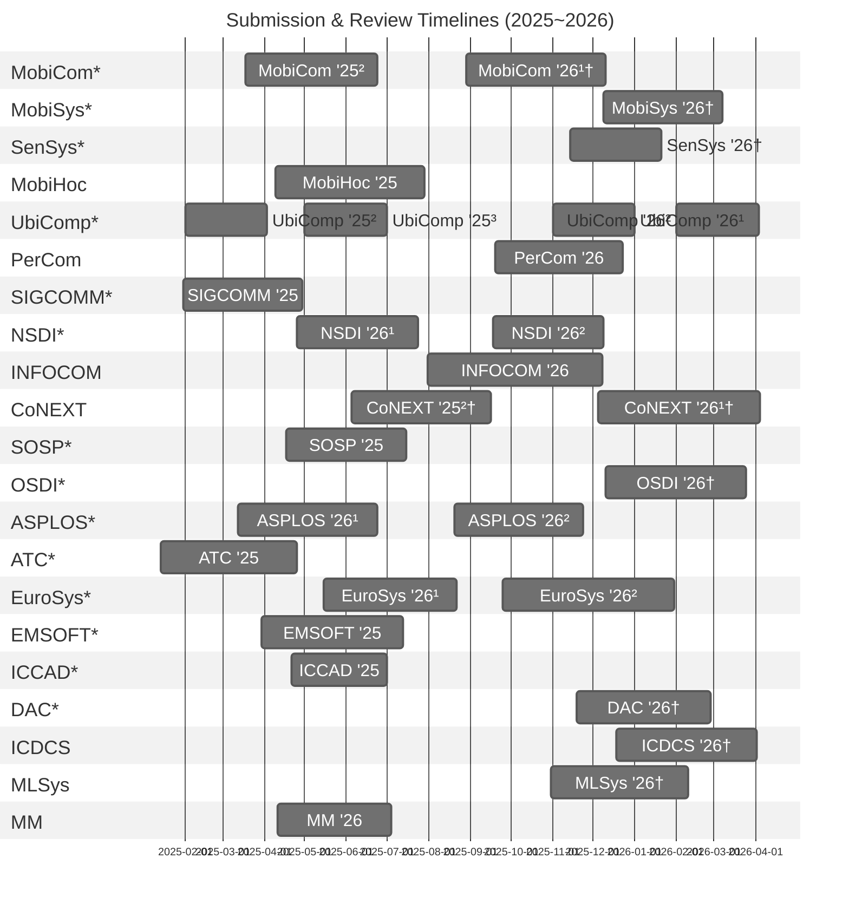

# Mobile-Systems-Conference-Timelines
This document collects peer review timelines (from submission to final notification) of top conferences directly related to mobile computing and systems, as well as top venues in adjacent areas such as computer networks, operating systems, and embedded systems.

\* Top conferences listed on [csrankings.org](https://csrankings.org).  
† Estimated schedules based on prior years, as the official call for papers has not yet been released.

## 📅 Gantt Chart (Submission – Final Notification, YYYY-MM-DD)

## 📅 Sorted by Submission Date (Ascending Order, YYYY-MM-DD)

### 2025

| Conference         | Submission Date      | Author Response / Rebuttal       | Final Notification | CFP URL |
|------------------|--------------------|-------------------------------|---------------------|---------|
| ATC '25          | 2025-01-14         | 2025-04-07 – 2025-04-09       | 2025-04-25          | [CFP](https://www.usenix.org/conference/atc25/call-for-papers) |
| SIGCOMM '25      | 2025-01-31         | None (One-shot reivision for some) | 2025-04-29     | [CFP](https://conferences.sigcomm.org/sigcomm/2025/cfp/) |
| UbiComp '25²     | 2025-02-01         | None                          | 2025-04-01          | [CFP](https://www.ubicomp.org/ubicomp-iswc-2025/authors/) |
| ASPLOS '26¹      | 2025-03-12         | 2025-06-09 – 2025-06-13       | 2025-06-24          | [CFP](https://www.asplos-conference.org/asplos2026/cfp/) |
| MobiCom '25²     | 2025-03-18         | None                          | 2025-06-24          | [CFP](https://www.sigmobile.org/mobicom/2025/cfp.html) |
| EMSOFT '25       | 2025-03-30         | 2025-05-18 – 2025-06-15 (Revision) | 2025-07-13     | [CFP](https://esweek.org/emsoft-call-for-papers-page/) |
| MobiHoc '25      | 2025-04-09         | 2025-06-30 – 2025-07-06       | 2025-07-29          | [CFP](https://www.sigmobile.org/mobihoc/2025/cfp.html) |
| MM '26           | 2025-04-11         | 2025-06-09 – 2025-06-16       | 2025-07-04          | [CFP](https://acmmm2025.org/call-for-papers/) |
| SOSP '25         | 2025-04-17         | 2025-07-03 – 2025-07-13       | 2025-07-15          | [CFP](https://sigops.org/s/conferences/sosp/2025/cfp.html) |
| ICCAD '25        | 2025-04-21         | None                          | 2025-06-30          | [CFP](https://2025.iccad.com/) |
| NSDI '26¹        | 2025-04-25         | ?                             | 2025-07-24          | [CFP](https://www.usenix.org/conference/nsdi26/call-for-papers) |
| UbiComp '25³     | 2025-05-01         | None                          | 2025-07-01          | [CFP](https://www.ubicomp.org/ubicomp-iswc-2025/authors/) |
| EuroSys '26¹     | 2025-05-15         | 2025-07-30 – 2025-08-01       | 2025-08-22          | [CFP](https://2026.eurosys.org/cfp.html#calls) |
| CoNEXT '25²      | 2025-06-05         | None (One-shot reivision for some) | 2025-09-15     | [CFP](https://conferences.sigcomm.org/co-next/2025/#!/cfp) |
| INFOCOM '26      | 2025-07-31         | None                          | 2025-12-08          | [CFP](https://infocom2026.ieee-infocom.org/call-papers) |
| ASPLOS '26²      | 2025-08-20         | 2025-11-10 – 2025-11-14       | 2025-11-24          | [CFP](https://www.asplos-conference.org/asplos2026/cfp/) |
| MobiCom '26¹†    | 2025-08-29         | ?                             | 2025-12-10          | - |
| NSDI '26²        | 2025-09-18         | ?                             | 2025-12-09          | [CFP](https://www.usenix.org/conference/nsdi26/call-for-papers) |
| PerCom '26       | 2025-09-19         | 2025-11-28 – 2025-12-05       | 2025-12-22          | [CFP](https://percom.org/call-for-papers/) |
| EuroSys '26²     | 2025-09-25         | 2026-01-07 – 2026-01-09       | 2026-01-30          | [CFP](https://2026.eurosys.org/cfp.html#calls) |
| MLSys '26†       | 2025-10-31         | 2026-01-20 – 2026-01-27       | 2026-02-10          | - |
| UbiComp '26¹     | 2025-11-01         | None                          | 2026-01-01          | - |
| SenSys '26†      | 2025-11-14         | None                          | 2026-01-21          | - |
| DAC '26†         | 2025-11-19         | ?                             | 2026-02-26          | - |
| CoNEXT '26¹†     | 2025-12-05         | None (One-shot reivision for some) | 2026-04-04     | - |
| MobiSys '26†     | 2025-12-09         | 2026-02-13 – 2025-02-17       | 2026-03-07          | [CFP](https://www.sigmobile.org/mobisys/2026/call_for_papers/) |
| OSDI '26†        | 2025-12-10         | 2026-03-06 – 2026-03-10       | 2026-03-25          | - |
| ICDCS '26†       | 2025-12-18         | None                          | 2026-04-02          | - |

### 2026
| Conference         | Submission Date      | Author Response / Rebuttal       | Final Notification | CFP URL |
|------------------|--------------------|-------------------------------|---------------------|---------|
| UbiComp '26²     | 2026-02-01         | None                          | 2026-04-02          | - |

