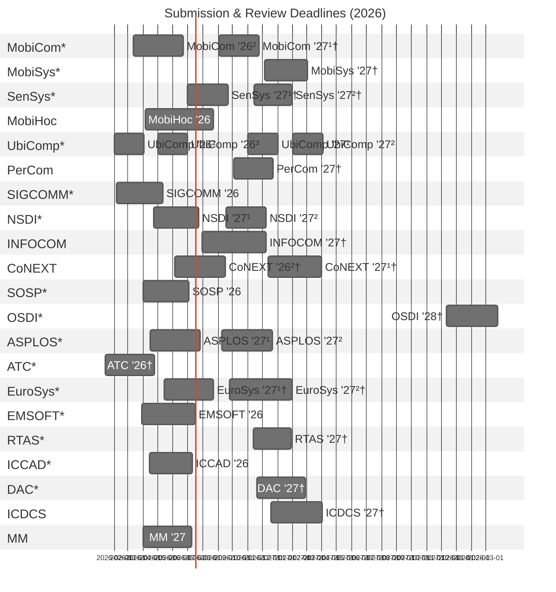

# 📱 Mobile Systems Conference Deadlines (2026)
Peer review timelines (submission → final notification)  
for major venues in Mobile / Networking / Systems / Embedded / Multimedia.

- `*` = Top conference ([CSRankings](https://csrankings.org/))
- `†` = Estimated schedule
- Duration = submission → final notification

**Last updated:** 2026-02-13

**My go-to CS conference rankings:**
* [CSRankings](https://csrankings.org/)
* [Rankings in South Korea (KISSE/NRF BK21+/Universities)](https://gist.github.com/Pusnow/6eb933355b5cb8d31ef1abcb3c3e1206)
