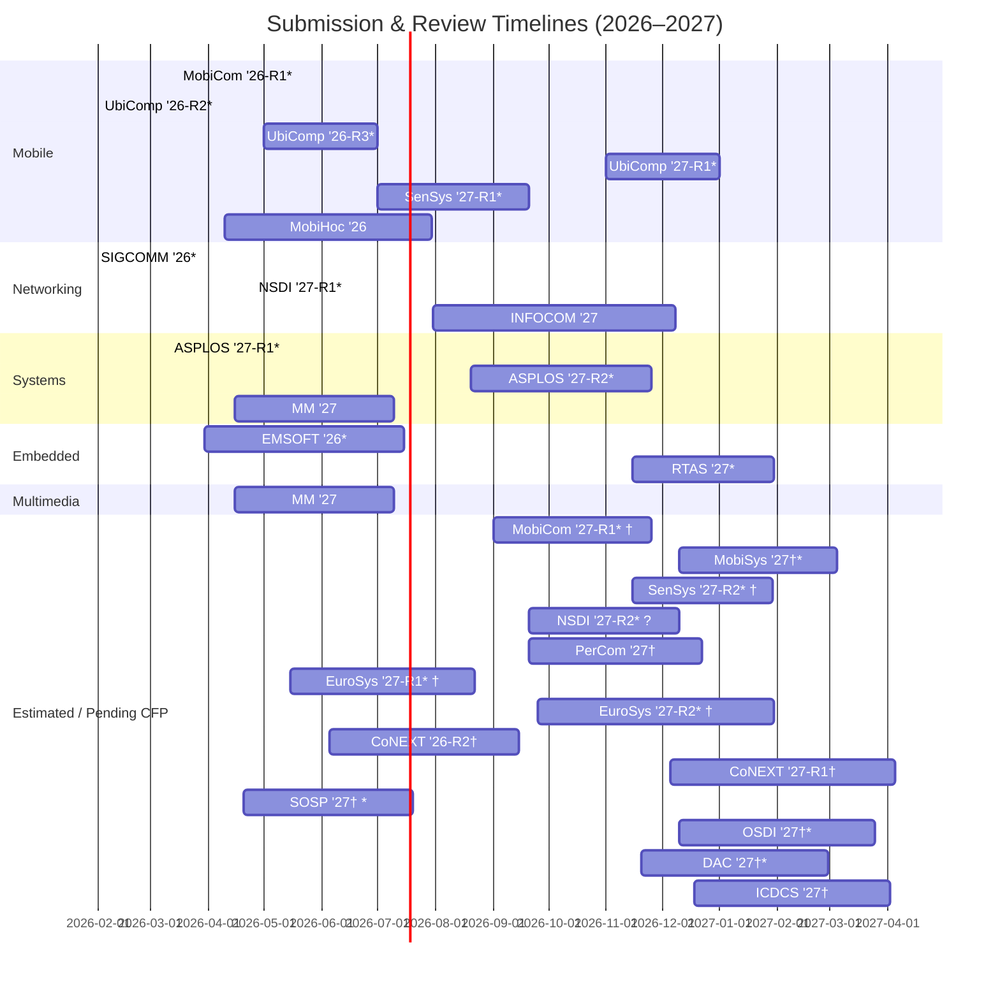

# 📱 Mobile Systems Conference Timelines (2026–2027)
Peer review timelines (submission → final notification)  
for major venues in Mobile / Networking / Systems / Embedded / Multimedia.

- `*` = Top conference (csrankings)
- `†` = Estimated schedule
- Duration = submission → final notification

**Last updated:** 2026-02-13

---

# 📊 Gantt Chart (2026–2027)

