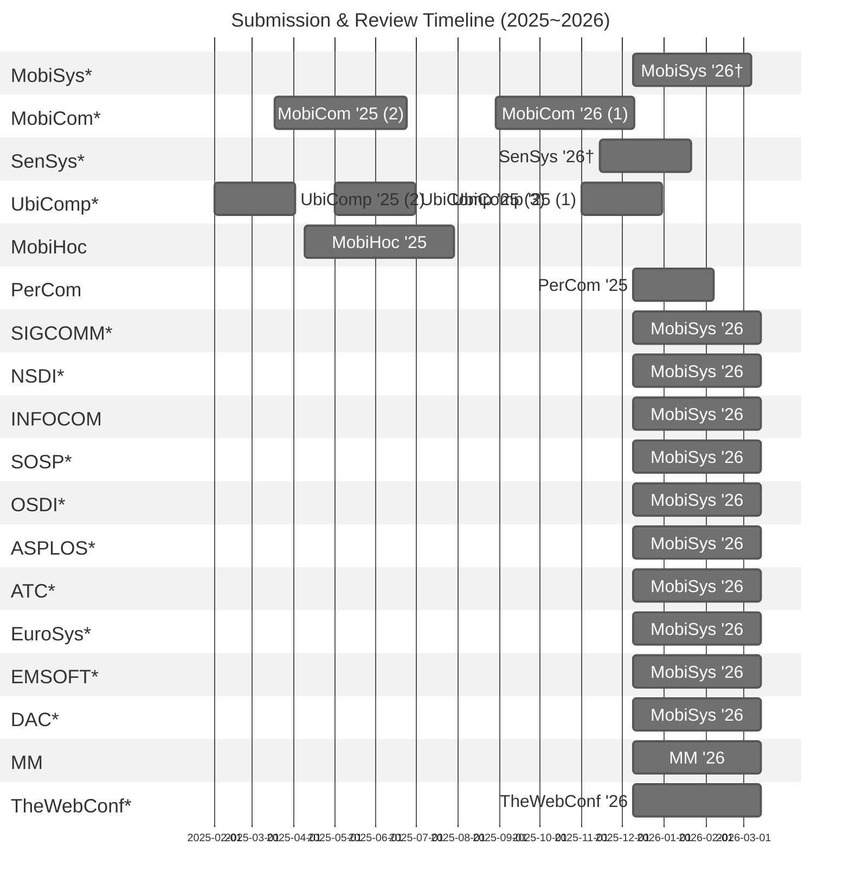

# Systems-Conference-Timelines 📅
Peer review timelines of major conferences in mobile computing, computer networks, and operating systems (from submission to final notification).

\* Top conferences as listed on [csrankings.org](https://csrankings.org).  
† Estimated schedules based on prior years, as the official call for papers has not yet been released.

