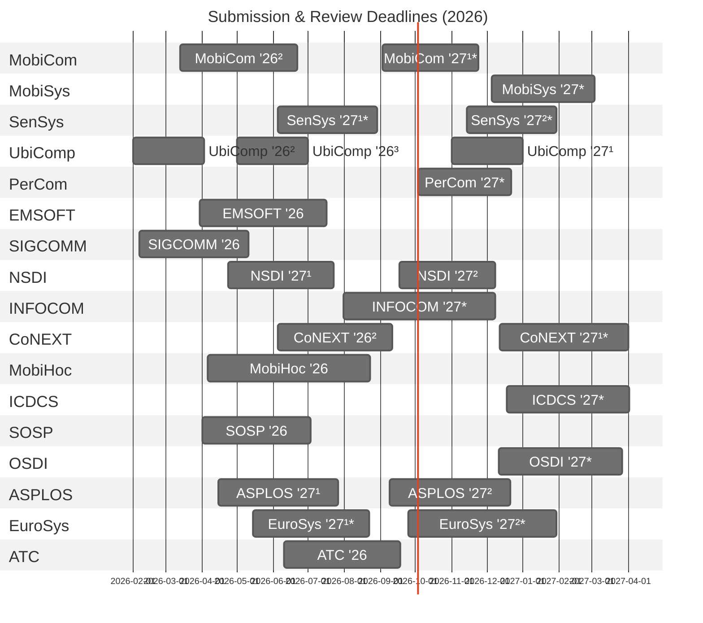

# 📱 Mobile Systems Conference Deadlines (2026)
Submission and peer-review timelines for major conferences in mobile and related systems.
- `*`: Estimated schedule (CFP is not out yet)
- Duration: submission → final notification
- Last updated: 2026-02-13

```mermaid
%%{init: {'theme': 'neutral',
'themeVariables': {
      'fontSize': '18px'},
"gantt": {
      "fontSize": 16,
      "sectionFontSize": 18,
      "leftPadding": 150,
      "displayMode": "compact",
      "barHeight": 30,
      "barGap": 5
  }}}%%
gantt
    dateFormat  YYYY-MM-DD
    tickInterval 1month
    title Submission & Review Deadlines (2026)

    %% --------------------------
    %% Mobile & Embedded
    %% --------------------------
    section MobiCom
    MobiCom '26² :mobicom26-review2, 2026-03-13, 101d
    MobiCom '27¹* :mobicom27-review1, 2026-09-03, 82d

    section MobiSys
    MobiSys '27* :mobisys27-review, 2026-12-05, 88d

    section SenSys
    SenSys '27¹* :sensys27-review1, 2026-06-05, 85d
    SenSys '27²* :sensys27-review2, 2026-11-14, 77d

    section UbiComp
    UbiComp '26² :ubicomp26-review3, 2026-02-01, 61d
    UbiComp '26³ :ubicomp26-review2, 2026-05-01, 61d
    UbiComp '27¹ :ubicomp27-review1, 2026-11-01, 61d

    section PerCom
    PerCom '27* :percom27-review, 2026-10-03, 80d

    section EMSOFT
    EMSOFT '26 :emsoft26-review, 2026-03-30, 109d

    %% --------------------------
    %% Networking / Distributed Systems
    %% --------------------------
    section SIGCOMM
    SIGCOMM '26 :sigcomm26-review, 2026-02-06, 94d

    section NSDI
    NSDI '27¹ :nsdi27-review1, 2026-04-23, 91d
    NSDI '27² :nsdi27-review2, 2026-09-17, 82d

    section INFOCOM
    INFOCOM '27* :infocom27-review, 2026-07-31, 130d

    section CoNEXT
    CoNEXT '26² :conext26-review2, 2026-06-05, 98d
    CoNEXT '27¹* :conext27-review1, 2026-12-12, 110d

    section MobiHoc
    MobiHoc '26 :mobihoc26-review, 2026-04-06, 139d

    section ICDCS
    ICDCS '27* :icdcs27-review, 2026-12-18, 105d

    %% --------------------------
    %% Operating Systems
    %% --------------------------
    section SOSP
    SOSP '26 :sosp26-review, 2026-04-01, 93d

    section OSDI
    OSDI '27* :osdi27-review, 2026-12-11, 106d

    section ASPLOS
    ASPLOS '27¹ :asplos27-review1, 2026-04-15, 103d
    ASPLOS '27² :asplos27-review2, 2026-09-09, 103d

    section EuroSys
    EuroSys '27¹* :eurosys27-review1, 2026-05-15, 99d
    EuroSys '27²* :eurosys27-review2, 2026-09-25, 127d

    section ATC
    ATC '26 :atc26-review, 2026-06-10, 100d
```

### CFP Reference Table

| Conference | Submission | Final Notification | CFP Link |
|------------|------------|--------------------|----------|
| MobiCom '26² | 2026-03-13 | 2026-06-22 | https://www.sigmobile.org/mobicom/2026/cfp.html |
| MobiCom '27¹* | 2026-09-03 | 2026-11-24 |  |
| MobiSys '27* | 2026-12-05 | 2027-03-05 | https://www.sigmobile.org/mobisys/2026/call_for_papers/ |
| SenSys '27¹* | 2026-06-05 | 2026-08-31 | https://sensys.acm.org/2027/cfp.html |
| SenSys '27²* | 2026-11-14 | 2027-01-29 | https://sensys.acm.org/2027/cfp.html |
| UbiComp '26² | 2026-02-01 | 2026-04-02 | https://dl.acm.org/journal/imwut/how-to-submit |
| UbiComp '26³ | 2026-05-01 | 2026-07-02 | https://dl.acm.org/journal/imwut/how-to-submit |
| UbiComp '27¹ | 2026-11-01 | 2027-01-01 | https://dl.acm.org/journal/imwut/how-to-submit |
| PerCom '27* | 2026-10-03 | 2026-12-22 |  |
| EMSOFT '26 | 2026-03-30 | 2026-07-17 | https://esweek.org/emsoft_cfp/ |
| SIGCOMM '26 | 2026-02-06 | 2026-05-11 | https://conferences.sigcomm.org/sigcomm/2026/cfp/ |
| NSDI '27¹ | 2026-04-23 | 2026-07-23 | https://www.usenix.org/conference/nsdi27/call-for-papers |
| NSDI '27² | 2026-09-17 | 2026-12-08 | https://www.usenix.org/conference/nsdi27/call-for-papers |
| INFOCOM '27* | 2026-07-31 | 2026-12-08 |  |
| CoNEXT '26²* | 2026-06-05 | 2026-09-11 | https://conferences.sigcomm.org/co-next/2026/#!/cfp |
| CoNEXT '27¹* | 2026-12-12 | 2027-03-31 |  |
| MobiHoc '26 | 2026-04-06 | 2026-08-23 | https://www.sigmobile.org/mobihoc/2026/cfp.html |
| ICDCS '27* | 2026-12-18 | 2027-04-02 |  |
| SOSP '26 | 2026-04-01 | 2026-07-03 | https://sigops.org/s/conferences/sosp/2026/cfp.html |
| OSDI '27* | 2026-12-11 | 2027-03-26 |  |
| ASPLOS '27¹ | 2026-04-15 | 2026-07-27 | https://www.asplos-conference.org/asplos2026/cfp.html |
| ASPLOS '27² | 2026-09-09 | 2026-12-21 | https://www.asplos-conference.org/asplos2026/cfp.html |
| ATC '26 | 2026-06-10 | 2026-09-18 | https://sigops.org/s/conferences/atc/2026/cfp.html |
| EuroSys '27¹* | 2026-05-15 | 2026-08-22 |  |
| EuroSys '27²* | 2026-09-25 | 2027-01-30 |  |

### My Go-To Top CS Conference Lists
* [CSRankings](https://csrankings.org/)
* [Institutional Guidelines in South Korea (KIISE/NRF BK21+/Universities)](https://gist.github.com/Pusnow/6eb933355b5cb8d31ef1abcb3c3e1206)
