# Mobile-Systems-Conference-Timelines 📅
Peer review timelines of major conferences in mobile systems, computer networks, operating systems, etc. (from submission to final notification).

\* Top conferences listed on [csrankings.org](https://csrankings.org).  
† Estimated schedules based on prior years, as the official call for papers has not yet been released.

```mermaid
%%{init: {'theme': 'neutral',
'themeVariables': {
      'fontSize': '18px'},
"gantt": {
      "fontSize": 16,
      "sectionFontSize": 18,
      "leftPadding": 150,
      "displayMode": "compact",
      "barHeight": 30,
      "barGap": 10
  }}}%%
gantt
    dateFormat  YYYY-MM-DD
    tickInterval 1month
    title Submission & Review Timelines (2025~2026)

    %% --------------------------
    %% Mobile
    %% --------------------------
    section MobiCom*
    MobiCom '25 (2) :mobicom-review2, 2025-03-18, 98d
    MobiCom '26 (1) :mobicom-review1, 2025-08-29, 103d

    section MobiSys*
    MobiSys '26† :mobisys-review, 2025-12-09, 88d

    section SenSys*
    SenSys '26† :sensys-review, 2025-11-14, 68d

    section UbiComp*
    UbiComp '25 (2) :ubicomp25-review3, 2025-02-01, 60d
    UbiComp '25 (3) :ubicomp25-review2, 2025-05-01, 60d
    UbiComp '25 (1) :ubicomp25-review1, 2025-11-01, 60d
    UbiComp '26† (2) :ubicomp26-review3, 2025-02-01, 60d

    section MobiHoc
    MobiHoc '25 :mobihoc-review, 2025-04-09, 111d

    section PerCom
    PerCom '26† :percom-review, 2025-12-09, 77d

    %% --------------------------
    %% Network
    %% --------------------------
    section SIGCOMM*
    SIGCOMM '25 :sigcomm-review, 2025-01-31, 88d

    section NSDI*
    NSDI '26 (1) :nsdi-review1, 2025-04-25, 90d
    NSDI '26 (2) :nsdi-review2, 2025-09-18, 82d

    section INFOCOM
    INFOCOM '26† :infocom-review, 2025-07-31, 128d

    section CoNEXT
    CoNEXT '26 (1)† :conext-review1, 2025-12-05, 120d
    CoNEXT '25 (2)† :conext-review2, 2025-07-14, 60d

    %% --------------------------
    %% OS, CA
    %% --------------------------
    section SOSP*
    SOSP '25 :sosp-review, 2025-04-17, 89d

    section OSDI*
    OSDI '26 :osdi-review, 2025-12-10, 105d

    section ASPLOS*
    ASPLOS '26 (1) :asplos-review1, 2025-03-12, 104d
    ASPLOS '26 (2) :asplos-review2, 2025-08-20, 96d

    section ATC*
    ATC '25 :atc25-review, 2025-01-14, 101d
    ATC '26† :atc26-review, 2026-01-14, 101d

    section EuroSys*
    EuroSys '26 :eurosys-review1, 2025-05-15, 99d
    EuroSys '26 :eurosys-review2, 2025-09-25, 127d


    %% --------------------------
    %% Embedded / EDA
    %% --------------------------
    section EMSOFT*
    EMSOFT '25 :emsoft-review, 2025-03-30, 105d

    section DAC*
    DAC '26† :mobisys-review, 2025-11-19, 99d


    %% --------------------------
    %% Multimedia
    %% --------------------------
    section MM
    MM '26 :mm-review, 2025-04-11, 84d

    %% --------------------------
    %% Web
    %% --------------------------
    section TheWebConf*
    TheWebConf '26† :thewebconf-review, 2025-10-14, 98d
```

