# Mobile-Systems-Conference-Timelines
This document collects peer review timelines (from submission to final notification) of top conferences directly related to mobile computing and systems, as well as top venues in adjacent areas such as computer networks, operating systems, and embedded systems.

\* Top conferences listed on [csrankings.org](https://csrankings.org).  
† Estimated schedules based on prior years, as the official call for papers has not yet been released.

## 📅 Gantt Chart (Submission – Final Notification, YYYY-MM-DD)

```mermaid
%%{init: {'theme': 'neutral',
'themeVariables': {
      'fontSize': '18px'},
"gantt": {
      "fontSize": 16,
      "sectionFontSize": 18,
      "leftPadding": 150,
      "displayMode": "compact",
      "barHeight": 30,
      "barGap": 5
  }}}%%
gantt
    dateFormat  YYYY-MM-DD
    tickInterval 1month
    title Submission & Review Timelines (2025~2026)

    %% --------------------------
    %% Mobile
    %% --------------------------
    section MobiCom*
    MobiCom '25² :mobicom25-review2, 2025-03-18, 98d
    MobiCom '26¹† :mobicom26-review1, 2025-08-29, 103d

    section MobiSys*
    MobiSys '26† :mobisys26-review, 2025-12-09, 88d

    section SenSys*
    SenSys '26† :sensys26-review, 2025-11-14, 68d

    section MobiHoc
    MobiHoc '25 :mobihoc25-review, 2025-04-09, 111d

    section UbiComp*
    UbiComp '25² :ubicomp25-review3, 2025-02-01, 61d
    UbiComp '25³ :ubicomp25-review2, 2025-05-01, 61d
    UbiComp '26¹ :ubicomp25-review1, 2025-11-01, 61d
    UbiComp '26² :ubicomp26-review3, 2026-02-01, 61d

    section PerCom
    PerCom '26 :percom26-review, 2025-09-19, 95d

    %% --------------------------
    %% Network
    %% --------------------------
    section SIGCOMM*
    SIGCOMM '25 :sigcomm25-review, 2025-01-31, 88d

    section NSDI*
    NSDI '26¹ :nsdi26-review1, 2025-04-25, 90d
    NSDI '26² :nsdi26-review2, 2025-09-18, 82d

    section INFOCOM
    INFOCOM '26 :infocom26-review, 2025-07-31, 130d

    section CoNEXT
    CoNEXT '26¹† :conext26-review1, 2025-12-05, 120d
    CoNEXT '25²† :conext25-review2, 2025-06-05, 103d

    %% --------------------------
    %% OS, CA
    %% --------------------------
    section SOSP*
    SOSP '25 :sosp25-review, 2025-04-17, 89d

    section OSDI*
    OSDI '26† :osdi26-review, 2025-12-10, 105d

    section ASPLOS*
    ASPLOS '26¹ :asplos26-review1, 2025-03-12, 104d
    ASPLOS '26² :asplos26-review2, 2025-08-20, 96d

    section ATC*
    ATC '25 :atc25-review, 2025-01-14, 101d

    section EuroSys*
    EuroSys '26¹ :eurosys26-review1, 2025-05-15, 99d
    EuroSys '26² :eurosys26-review2, 2025-09-25, 127d

    %% --------------------------
    %% Embedded / EDA
    %% --------------------------
    section EMSOFT*
    EMSOFT '25 :emsoft25-review, 2025-03-30, 105d

    section ICCAD*
    ICCAD '25 :iccad25-review, 2025-04-21, 71d

    section DAC*
    DAC '26† :dac26-review, 2025-11-19, 99d

    section ICDCS
    ICDCS '26† :icdcs26-review, 2025-12-18, 105d

    %% --------------------------
    %% ML
    %% --------------------------
    section MLSys
    MLSys '26† :mlsys26-review, 2025-10-31, 102d

    %% --------------------------
    %% Multimedia
    %% --------------------------
    section MM
    MM '26 :mm26-review, 2025-04-11, 84d


```

## 📅 Sorted by Submission Date (Ascending Order, YYYY-MM-DD)

### 2025

| Conference         | Submission Date      | Author Response / Rebuttal       | Final Notification | CFP URL |
|------------------|--------------------|-------------------------------|---------------------|---------|
| ATC '25          | 2025-01-14         | 2025-04-07 – 2025-04-09       | 2025-04-25          | [CFP](https://www.usenix.org/conference/atc25/call-for-papers) |
| SIGCOMM '25      | 2025-01-31         | None (One-shot reivision for some) | 2025-04-29     | [CFP](https://conferences.sigcomm.org/sigcomm/2025/cfp/) |
| UbiComp '25²     | 2025-02-01         | None                          | 2025-04-01          | [CFP](https://www.ubicomp.org/ubicomp-iswc-2025/authors/) |
| ASPLOS '26¹      | 2025-03-12         | 2025-06-09 – 2025-06-13       | 2025-06-24          | [CFP](https://www.asplos-conference.org/asplos2026/cfp/) |
| MobiCom '25²     | 2025-03-18         | None                          | 2025-06-24          | [CFP](https://www.sigmobile.org/mobicom/2025/cfp.html) |
| EMSOFT '25       | 2025-03-30         | 2025-05-18 – 2025-06-15 (Revision) | 2025-07-13     | [CFP](https://esweek.org/emsoft-call-for-papers-page/) |
| MobiHoc '25      | 2025-04-09         | 2025-06-30 – 2025-07-06       | 2025-07-29          | [CFP](https://www.sigmobile.org/mobihoc/2025/cfp.html) |
| MM '26           | 2025-04-11         | 2025-06-09 – 2025-06-16       | 2025-07-04          | [CFP](https://acmmm2025.org/call-for-papers/) |
| SOSP '25         | 2025-04-17         | 2025-07-03 – 2025-07-13       | 2025-07-15          | [CFP](https://sigops.org/s/conferences/sosp/2025/cfp.html) |
| ICCAD '25        | 2025-04-21         | None                          | 2025-06-30          | [CFP](https://2025.iccad.com/) |
| NSDI '26¹        | 2025-04-25         | ?                             | 2025-07-24          | [CFP](https://www.usenix.org/conference/nsdi26/call-for-papers) |
| UbiComp '25³     | 2025-05-01         | None                          | 2025-07-01          | [CFP](https://www.ubicomp.org/ubicomp-iswc-2025/authors/) |
| EuroSys '26¹     | 2025-05-15         | 2025-07-30 – 2025-08-01       | 2025-08-22          | [CFP](https://2026.eurosys.org/cfp.html#calls) |
| CoNEXT '25²      | 2025-06-05         | None (One-shot reivision for some) | 2025-09-15     | [CFP](https://conferences.sigcomm.org/co-next/2025/#!/cfp) |
| INFOCOM '26      | 2025-07-31         | None                          | 2025-12-08          | [CFP](https://infocom2026.ieee-infocom.org/call-papers) |
| ASPLOS '26²      | 2025-08-20         | 2025-11-10 – 2025-11-14       | 2025-11-24          | [CFP](https://www.asplos-conference.org/asplos2026/cfp/) |
| MobiCom '26¹†    | 2025-08-29         | ?                             | 2025-12-10          | - |
| NSDI '26²        | 2025-09-18         | ?                             | 2025-12-09          | [CFP](https://www.usenix.org/conference/nsdi26/call-for-papers) |
| PerCom '26       | 2025-09-19         | 2025-11-28 – 2025-12-05       | 2025-12-22          | [CFP](https://percom.org/call-for-papers/) |
| EuroSys '26²     | 2025-09-25         | 2026-01-07 – 2026-01-09       | 2026-01-30          | [CFP](https://2026.eurosys.org/cfp.html#calls) |
| MLSys '26†       | 2025-10-31         | 2026-01-20 – 2026-01-27       | 2026-02-10          | - |
| UbiComp '26¹     | 2025-11-01         | None                          | 2026-01-01          | - |
| SenSys '26†      | 2025-11-14         | None                          | 2026-01-21          | - |
| DAC '26†         | 2025-11-19         | ?                             | 2026-02-26          | - |
| CoNEXT '26¹†     | 2025-12-05         | None (One-shot reivision for some) | 2026-04-04     | - |
| MobiSys '26†     | 2025-12-09         | 2026-02-13 – 2025-02-17       | 2026-03-07          | [CFP](https://www.sigmobile.org/mobisys/2026/call_for_papers/) |
| OSDI '26†        | 2025-12-10         | 2026-03-06 – 2026-03-10       | 2026-03-25          | - |
| ICDCS '26†       | 2025-12-18         | None                          | 2026-04-02          | - |

### 2026
| Conference         | Submission Date      | Author Response / Rebuttal       | Final Notification | CFP URL |
|------------------|--------------------|-------------------------------|---------------------|---------|
| UbiComp '26²     | 2026-02-01         | None                          | 2026-04-02          | - |

